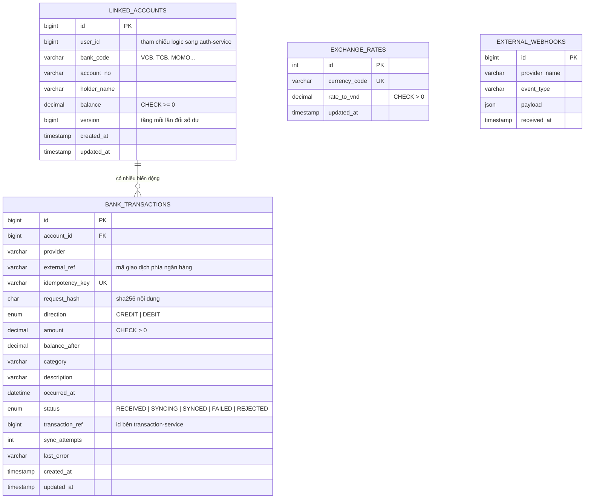

# ERD - Integration Service (Go)

Database: `integration_db` (MySQL), chỉ integration-service được đọc ghi.

## Ràng buộc

| Bảng | Ràng buộc | Mục đích |
|---|---|---|
| `linked_accounts` | `UNIQUE (bank_code, account_no)` | 1 tài khoản ngân hàng chỉ liên kết 1 lần |
| `linked_accounts` | `CHECK (balance >= 0)` | db tự chặn nếu code có lỗi làm âm số dư |
| `bank_transactions` | `UNIQUE (idempotency_key)` | chống ghi trùng theo key |
| `bank_transactions` | `UNIQUE (provider, external_ref)` | chống ghi trùng theo mã giao dịch ngân hàng, kể cả khi client đổi key |
| `bank_transactions` | `FK account_id -> linked_accounts(id) ON DELETE CASCADE` | |
| `bank_transactions` | `INDEX (status, updated_at)` | sweeper tìm nhanh giao dịch cần thử lại |
| `bank_transactions` | `INDEX (account_id, occurred_at)` | xem lịch sử theo tài khoản |

## Liên kết với service khác

- `linked_accounts.user_id` -> `users.id` bên **auth-service** (không đặt khóa ngoại vì khác database)
- `bank_transactions.transaction_ref` -> `transactions.id` bên **transaction-service**, có giá trị khi đã `SYNCED`
- `external_webhooks` và `exchange_rates` đứng độc lập
