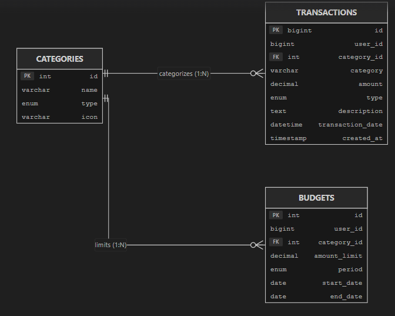
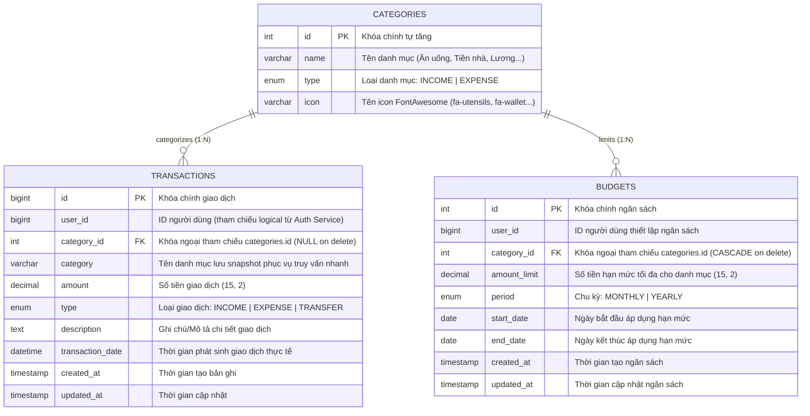

# Sơ đồ Thực thể Liên kết (ERD) - Transaction & Budget Service

## 1. Hình ảnh Sơ đồ ERD Trực quan

> 💡 **Cách xem trực tiếp trong VS Code:**
> - Nhấn phím tắt **`Ctrl + Shift + V`** (hoặc nhấn vào biểu tượng **Open Preview to the Side** ở góc trên cùng bên phải màn hình) để xem văn bản kèm ảnh trực quan.

---

## 2. Mã nguồn Sơ đồ Mermaid (Dự phòng)

---

## 3. Bảng Mô tả Chi tiết Thực thể & Thuộc tính

### 3.1. Bảng `categories` (Danh mục thu / chi)
- **Mục đích:** Phân loại các khoản tiền thu vào hoặc chi ra của người dùng (ví dụ: Lương, Freelance, Ăn uống, Tiền nhà, Mua sắm...).
- **Khóa chính:** `id` (INT, AUTO_INCREMENT).
- **Ràng buộc:** 
  - `type` chỉ nhận `INCOME` hoặc `EXPENSE`.
  - Hỗ trợ gắn icon giao diện (`icon`).

### 3.2. Bảng `transactions` (Giao dịch thu / chi / chuyển khoản)
- **Mục đích:** Lưu trữ mọi dòng tiền biến động của người dùng theo thời gian thực.
- **Khóa chính:** `id` (BIGINT, AUTO_INCREMENT).
- **Liên kết logic (SOA):** `user_id` liên kết với dịch vụ `Auth Service` (không tạo foreign key cứng để bảo toàn nguyên tắc Database-per-Service trong Microservices).
- **Khóa ngoại:** `category_id` tham chiếu `categories(id)` với hành vi `ON DELETE SET NULL`.
- **Chỉ mục (Index):** `idx_user_trans (user_id, transaction_date)` để tối ưu tốc độ lọc lịch sử và phân tích biểu đồ của Analytics Service.

### 3.3. Bảng `budgets` (Hạn mức ngân sách)
- **Mục đích:** Đặt ngưỡng chi tiêu tối đa cho từng danh mục trong một khoảng thời gian (theo tháng hoặc theo năm).
- **Khóa chính:** `id` (INT, AUTO_INCREMENT).
- **Khóa ngoại:** `category_id` tham chiếu `categories(id)` với hành vi `ON DELETE CASCADE`.
- **Chỉ mục (Index):** `idx_user_budget (user_id, start_date, end_date)` phục vụ việc tra cứu nhanh hạn mức đang hiệu lực khi người dùng tạo giao dịch chi tiêu mới.

---

## 4. Mối quan hệ giữa các Thực thể (Relationships)
1. **`categories` - `transactions` (Quan hệ 1 - N):** Một danh mục có thể chứa nhiều giao dịch thu/chi. Một giao dịch thuộc về một danh mục (hoặc NULL nếu danh mục bị xóa).
2. **`categories` - `budgets` (Quan hệ 1 - N):** Một danh mục có thể được thiết lập nhiều ngân sách qua các tháng/năm khác nhau.
3. **Mối quan hệ nghiệp vụ giữa `budgets` và `transactions`:** 
   - Không nối khóa ngoại trực tiếp mà được liên kết qua logic nghiệp vụ (`user_id`, `category_id`, khoảng thời gian `start_date` đến `end_date`).
   - Khi tạo giao dịch chi tiêu (`EXPENSE`), hệ thống tự động tính tổng tiền các giao dịch trong kỳ so sánh với `amount_limit` của bảng `budgets` để đưa ra cảnh báo thời gian thực (`budget_alert`).
