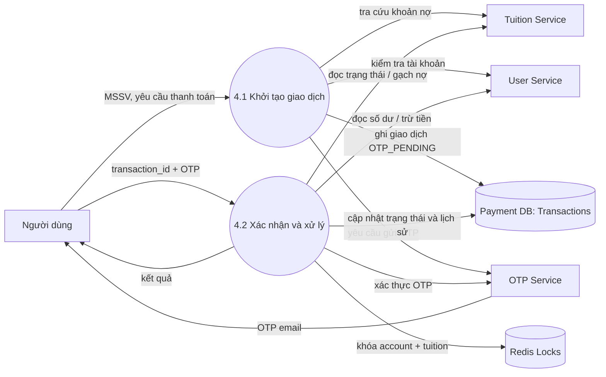
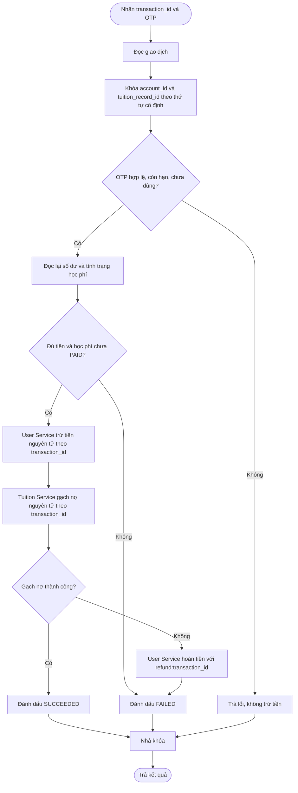

# DFD - Payment & Concurrency

## DFD mức 1: xử lý thanh toán

## DFD mức 2: xử lý xác nhận và khóa

## Nói ngắn gọn khi thuyết trình

“Em khóa đồng thời tài khoản và khoản học phí trong lúc xác nhận. Vì vậy, hai giao dịch không thể cùng kiểm tra một số dư cũ hoặc cùng gạch một khoản nợ. Sau khi lấy khóa, hệ thống kiểm tra lại OTP, số dư và trạng thái học phí. Nếu trừ tiền xong mà gạch nợ lỗi, hệ thống gọi hoàn tiền bù trừ.”

Redis lock chỉ có tác dụng nếu mọi Payment instance cùng dùng Redis đó. User Service vẫn phải trừ tiền bằng một câu lệnh nguyên tử (ví dụ `UPDATE ... WHERE balance >= amount`) và Tuition Service phải cập nhật có điều kiện `status = 'UNPAID'`; đây là lớp khóa cuối cùng chống race condition.
